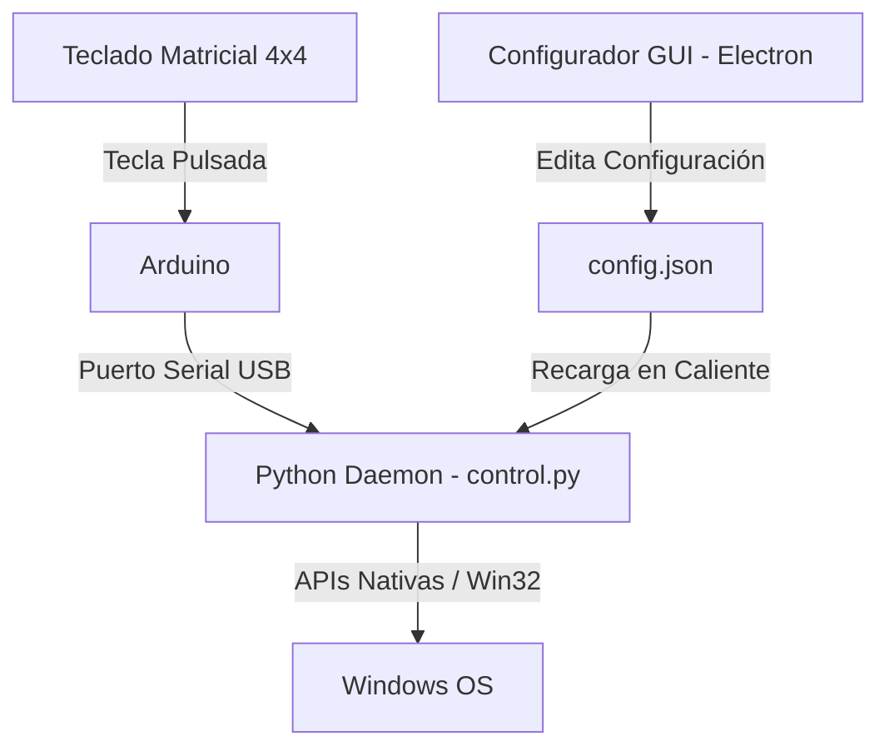

# MacroPad Deck: Teclado de Macros con Arduino y Electron

Este es un proyecto personal para construir y configurar un Macro Pad de escritorio utilizando un teclado matricial de 4x4, una placa Arduino y una interfaz gráfica para Windows construida en Electron.

El proyecto consta de tres partes principales:
1. **Arduino (Firmware):** Lee las pulsaciones físicas de la matriz y las envía por USB Serial a la computadora.
2. **Python Daemon (`control.py`):** Escucha el puerto COM de fondo, procesa las pulsaciones e inyecta las macros de teclado, abre aplicaciones o webs.
3. **Electron GUI (`MacroPadConfig`):** Una interfaz gráfica en Windows para asignar y ordenar visualmente las acciones de cada botón sin editar código.

---

## Características

* **Mapeo de la Matriz:** Configura de forma sencilla las 16 teclas físicas de la matriz de 4x4.
* **Arrastrar y Soltar (Drag & Drop):** Permite configurar accesos directos arrastrando archivos `.exe` locales o URLs directamente desde la barra de direcciones de tu navegador.
* **Reordenar Botones (Swapping):** Puedes reordenar la distribución del pad arrastrando los botones en la interfaz para intercambiar sus posiciones. El sistema actualiza los nombres y sus prefijos de tecla automáticamente en el archivo `config.json`.
* **Identificación Visual:** Muestra el logotipo de la aplicación (extrayendo el icono nativo de los `.exe` en alta resolución) o de la web (usando la API de Clearbit y el favicon de Google como respaldo), junto con un pequeño texto identificativo debajo de cada icono.
* **Lógicas de Alternancia (Toggle):**
  * **Steam / WhatsApp:** Si la aplicación está cerrada o minimizada la abre/restaura en primer plano. Si está abierta y al frente, la envía a la bandeja del sistema/cierra de forma nativa (resolviendo la pantalla gris y el tamaño pequeño típico de las apps de la Store).
  * **Configurador:** Permite abrir y cerrar la interfaz de Electron directamente con una tecla física de la matriz.
  * **Discord:** Permite mutear el micrófono o ensordecer el audio globalmente usando PowerShell.

---

## Cómo Funciona

El flujo de comunicación es el siguiente:



1. **Hardware:** Al presionar un botón en el teclado 4x4, el Arduino envía el carácter correspondiente (ej. `"A"`, `"5"`, `"#"`).
2. **Python Daemon:** Recibe el carácter por puerto serial, lee la acción asociada desde `config.json` y la ejecuta en un hilo de fondo (`threading`) para no congelar la lectura del puerto.
3. **Configurador (GUI):** Guarda los cambios en `config.json`. El daemon de Python vigila este archivo y recarga la configuración automáticamente al detectar un cambio.

---

## Distribución del Teclado (Matriz 4x4)

La correspondencia de las teclas físicas de la matriz mapeadas en el código es:

| Columna 1 | Columna 2 | Columna 3 | Columna 4 |
| :---: | :---: | :---: | :---: |
| **`1`** | **`2`** | **`3`** | **`4`** |
| **`5`** | **`6`** | **`7`** | **`8`** |
| **`9`** | **`0`** | **`*`** | **`#`** |
| **`A`** | **`B`** | **`C`** | **`D`** |

> [!NOTE]
> **Acciones y Scripts especiales:**
> Algunos botones se han mapeado a funciones internas de Python en lugar de aplicaciones externas:
> * **Steam:** Abre/oculta Steam.
> * **WhatsApp:** Abre/oculta WhatsApp.
> * **Configurador (Tecla D):** Abre o cierra la interfaz gráfica de Electron.
> * **Mute Discord:** Activa/desactiva el micrófono en Discord.
> * **Ensordecer Discord:** Activa/desactiva el audio de Discord.

---

## Detalles Técnicos y Estabilidad

Se implementaron algunas soluciones para que el uso diario sea cómodo y estable:
* **Bypass de Privilegios para Drag & Drop (Explorer.exe):** Dado que `control.py` requiere privilegios de Administrador para registrar hotkeys globales, cualquier programa hijo heredaría esta elevación. Windows UAC (UIPI) impide arrastrar archivos desde Explorer normal a un programa Admin. Para solucionarlo, el daemon abre la GUI a través de `explorer.exe`, lo que deseleva el proceso de Electron a usuario estándar y permite arrastrar ejecutables y URLs sin problemas.
* **Reconexión COM automática:** Si el puerto serial se congela o se desconecta el USB, el script de Python intenta deshabilitar y volver a habilitar el puerto COM mediante `pnputil` de Windows de manera transparente.
* **Foco y Pantalla Gris de WhatsApp:** La restauración de WhatsApp (UWP) se realiza mediante su protocolo nativo (`whatsapp:`) y el cierre mediante `WM_CLOSE`, lo que evita que la app inicie en segundo plano o muestre pantallas grises congeladas.

---

## Conexiones del Teclado Matricial

Para conectar el teclado matricial de 4x4 a la placa Arduino, utiliza la siguiente correspondencia de pines digitales:

* **Filas (Rows 0 a 3):** Pines digitales **8, 9, 10 y 11** del Arduino.
* **Columnas (Columns 0 a 3):** Pines digitales **5, 4, 3 y 2** del Arduino.

![Diagrama de Conexiones del Circuito]

)

---

## Visualización de la Interfaz Gráfica (UI)

La aplicación de Electron te permite reordenar, mapear y gestionar de forma visual y en caliente todos tus accesos directos:


![Vista previa de la Interfaz Gráfica]


---

## Instalación y Uso

### 1. Cargar el Firmware
Sube el código `.ino` de la carpeta `/arduino` a tu placa usando el IDE de Arduino.

### 2. Configurar el Daemon de Python
Instala las dependencias necesarias en una terminal con permisos de Administrador:
```bash
pip install pyserial keyboard watchdog
```
Configura la constante `PUERTO_SERIAL` (ej. `'COM6'`) en `control.py` y ejecuta el script:
```bash
python control.py
```

### 3. Ejecutar y Compilar la GUI (.exe)
1. Instala las dependencias de Node:
   ```bash
   npm install
   ```
2. Inicia en desarrollo:
   ```bash
   npm start
   ```
3. Compila el ejecutable portable para Windows:
   ```bash
   npm run package
   ```
   Esto generará la carpeta `MacroPadConfig-win32-x64` que contiene **`MacroPadConfig.exe`**.

> [!TIP]
> **Uso Recomendado con el Pad Físico:**
> Al compilar tu `MacroPadConfig.exe`, puedes mapear su ruta a una de tus teclas físicas (ej. la Tecla **D**). Gracias a las redirecciones de `control.py`, presionar este botón abrirá la interfaz en primer plano enfocada y lista para arrastrar elementos, y presionarlo de nuevo la cerrará limpiamente.

---

## Estructura del Archivo `config.json`

La configuración de las teclas se almacena en el archivo `config.json` con la siguiente estructura:

```json
{
    "1": {
        "nombre": "Tecla 1: Mute Discord",
        "tipo": "script",
        "valor": "mutear_discord"
    },
    "3": {
        "nombre": "Tecla 3: Code.exe",
        "tipo": "app",
        "valor": "C:\\Users\\Usuario\\AppData\\Local\\Programs\\Microsoft VS Code\\Code.exe"
    },
    "7": {
        "nombre": "Tecla 7: YouTube",
        "tipo": "web",
        "valor": "https://www.youtube.com"
    }
}
```
